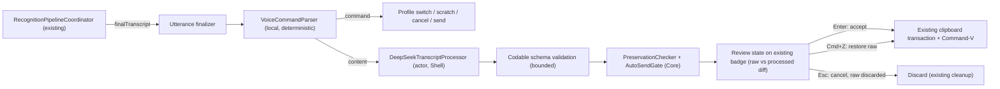

# Voice-to-Prompt Post-Processing — Orchestration Plan

**Branch:** `post_processing` (never merged to `main` until the owner says so).
**Processor:** DeepSeek API (`deepseek-v4-flash`, OpenAI-compatible endpoint, JSON mode, thinking disabled).
**Scope:** Mode A only — enhance text before inserting into the focused app. No unified chat client (Mode B) in this phase.

---

## 0. Decisions locked before any agent spawns

These resolve the plan's open choices; worktree agents do not relitigate them.

1. **Native Swift, no Python.** The Python reference in the source plan is a spec. The app is Swift 6 / macOS 14+; the processor must be a Swift actor using `URLSession`, with `Codable` contracts and hand-written bounded validators (mirroring the existing `RecognitionDecodingLimits` pattern). No Pydantic, no new SDK.
2. **No new SwiftPM target, no Package.swift change.** Contracts + profiles + validation go in `WhisperHotkeyCore` (pure, deterministic, value types only). The DeepSeek client + keychain helper go in `WhisperHotkeyShell`, next to the existing network precedent (`GitHubReleaseUpdateChecker`, `SoftwareUpdateInstaller`). Tests attach to the existing test targets. This keeps Package.swift (a shared file) untouched and every worktree merge trivial.
3. **Profiles are data.** `SemanticProfile` is a `Codable` struct; the built-in catalog (verbatim, clarity, coding) is a static array. The prompt is assembled deterministically from profile fields. No hardcoded `if profile == .coding` branches anywhere except prompt assembly. Custom user profiles and YAML files are **deferred** (a file-based catalog would demand a watcher or re-read logic; the app forbids idle work).
4. **Control plane is local and deterministic.** An exact-match voice-command table runs before any network call. Commands never reach the processor. "scratch that" maps to discard-current-session (equivalent to existing cancel) because this app has no multi-segment editing buffer.
5. **API key:** macOS Keychain via the Security framework, `DEEPSEEK_API_KEY` environment override for development. Never committed, never in UserDefaults, never in a profile.
6. **Privacy deviation is explicit and branch-scoped.** The product contract says the app never sends transcripts remotely. This branch breaks that, by owner request, and stays on this branch. The processor is **off by default**: no API key + no "Post-processing" toggle + no selected profile = zero network requests, identical to current behavior. Logs carry only provider, model, latency, byte sizes, and validation result — **never transcript text** (existing logging rule extended verbatim).
7. **Auto-send starts disabled.** Preview-and-approve only. Auto-send becomes eligible only after the bench gates in §6 pass and the owner explicitly enables it.
8. **Destination unchanged.** Processed text inserts through the existing clipboard transaction + Command-V path (`WhisperHotkeySystem/Delivery.swift`). No new paste mechanism.

---

## 1. Target data flow



New state-machine phase: `idle → preparing → listening → transcribing → reviewing → inserting → idle`.
Processor failure or timeout → preview shows the raw transcript with an "unavailable — inserting raw" state; Enter still inserts raw. Escape always aborts.

---

## 2. Shared contracts (fixed interfaces — every worktree codes against this text)

These signatures are the cross-worktree contract. Agents implement them verbatim; the orchestrator rejects drift.

```swift
// WhisperHotkeyCore — PostProcessingContract.swift
public protocol TranscriptProcessor: Sendable {
    func process(_ request: PostProcessRequest) async throws -> PostProcessResult
}

public struct PostProcessRequest: Codable, Equatable, Sendable {
    public var rawText: String
    public var profile: SemanticProfileID
    public var locale: String
    public var context: PostProcessContext
    public var alternatives: [String]
    public var uncertainSpans: [String]
    public var protectedTerms: [String]
    public init(rawText: String, profile: SemanticProfileID, locale: String,
                context: PostProcessContext, alternatives: [String] = [],
                uncertainSpans: [String] = [], protectedTerms: [String] = [])
}

public struct PostProcessContext: Codable, Equatable, Sendable {
    public var domain: String?
    public var language: String?
    public var framework: String?
    public var activeTask: String?
    public var frontmostApp: String?
    public var glossary: [String]
    public init(domain: String? = nil, language: String? = nil,
                framework: String? = nil, activeTask: String? = nil,
                frontmostApp: String? = nil, glossary: [String] = [])
}

public enum MeaningChangeRisk: String, Codable, Equatable, Sendable {
    case low, medium, high
}

public struct PostProcessResult: Codable, Equatable, Sendable {
    public var finalText: String
    public var intent: String
    public var unresolvedSpans: [String]
    public var explicitCorrections: [String]
    public var meaningChangeRisk: MeaningChangeRisk
}

public enum PostProcessLimits {
    // rawText ≤ 4000 chars; alternatives ≤ 8 × 200; uncertainSpans ≤ 32 × 80
    // protectedTerms ≤ 128 × 80; glossary ≤ 64 × 80
    // finalText ≤ 8000 chars; intent ≤ 400; corrections ≤ 32 × 160; unresolved ≤ 32 × 160
    public static let maxRawTextLength = 4_000
    public static let maxFinalTextLength = 8_000
    public static let maxAlternatives = 8
    public static let maxUncertainSpans = 32
    public static let maxProtectedTerms = 128
    public static let maxGlossaryTerms = 64
    public static let maxCorrections = 32
    public static func validateRequest(_ request: PostProcessRequest) throws
    public static func validateResult(_ result: PostProcessResult) throws
}

// WhisperHotkeyCore — SemanticProfile.swift
public enum SemanticProfileID: String, Codable, CaseIterable, Equatable, Sendable {
    case verbatim, clarity, coding
}

public struct SemanticProfile: Codable, Equatable, Sendable {
    public var id: SemanticProfileID
    public var name: String
    public var objective: String
    public var structure: [String]        // coding: Goal/Context/Requirements/...; others: []
    public var allowed: [String]
    public var forbidden: [String]
}

public enum SemanticProfileCatalog {
    public static let builtIn: [SemanticProfile]   // verbatim, clarity, coding (rules per source plan §3)
    public static func profile(_ id: SemanticProfileID) -> SemanticProfile
}

// WhisperHotkeyCore — VoiceCommandParser.swift
public enum VoiceCommand: Equatable, Sendable {
    case setProfile(SemanticProfileID)
    case scratchLastSegment
    case send
    case cancel
    case showOriginal
}
public enum VoiceCommandParser {
    public static func parse(_ text: String) -> VoiceCommand?   // trimmed, case-insensitive exact match; nil = content
}

// WhisperHotkeyCore — PreservationChecker.swift
public struct PreservationReport: Equatable, Sendable {
    public var issues: [String]   // protected/auto-protected tokens absent from finalText
    public var pass: Bool
}
public enum PreservationChecker {
    // auto-protects: URLs, `inline code`, numbers/percentages via the same regex class as the source plan
    public static func report(_ request: PostProcessRequest, _ result: PostProcessResult) -> PreservationReport
}

// WhisperHotkeyCore — AutoSendGate.swift
public enum AutoSendGate {
    // low risk && unresolvedSpans.isEmpty && report.pass
    public static func evaluate(_ result: PostProcessResult, _ report: PreservationReport) -> Bool
}

// WhisperHotkeyShell — DeepSeekTranscriptProcessor.swift
public actor DeepSeekTranscriptProcessor: TranscriptProcessor {
    public init(apiKeyProvider: @escaping @Sendable () async throws -> String,
                configuration: DeepSeekConfiguration = .init())
    // POST {baseURL}/chat/completions — OpenAI-compatible shape
    // model from configuration (default env DEEPSEEK_PROCESSOR_MODEL ?? "deepseek-v4-flash")
    // response_format {"type":"json_object"}; extra_body thinking disabled; max_tokens 800
    // 5 s timeout; retry once ONLY on empty output or schema-invalid JSON;
    // never retry 401/403/429(no) — fail to raw-transcript fallback
    // logs: provider, model, latency ms, request/response byte sizes, validation outcome. NEVER text.
}

public struct DeepSeekConfiguration: Sendable {
    public var baseURL: URL            // https://api.deepseek.com
    public var model: String           // env override, else deepseek-v4-flash
    public var timeout: TimeInterval   // 5.0
    public var maxOutputTokens: Int    // 800
}

// WhisperHotkeyShell — ProcessorKeychain.swift (Security framework)
public enum ProcessorKeychain {
    public static func store(apiKey: String) throws
    public static func read() throws -> String?
    public static func delete() throws
}

// WhisperHotkeyCore — PostProcessPreview.swift (UI + App share this)
public struct PostProcessPreview: Equatable, Sendable {
    public var rawText: String
    public var processed: PostProcessResult?
    public var report: PreservationReport
    public var profile: SemanticProfileID
    public var unavailable: Bool   // true when processor failed → raw shown
}
```

**State machine additions** (owned by the App-integration worktree, §4):

```swift
// DictationPhase: add case reviewing
// DictationEvent: add case processingRequested, reviewAccepted, reviewCancelled
// DictationEffect: add case requestProcessing, showReview(PostProcessPreview)
```

---

## 3. Context pack policy (v1)

- **Lexical (always):** internal dictionary entries + recognition `protectedTerms` + glossary derived from the coding profile's domain fields.
- **Task (usually):** `frontmostApp` from `NSWorkspace` (one query per dictation), locale, profile fields.
- **Conversational: none.** Selected-text and conversation-summary context are deferred.
- Hard cap on the serialized context pack: 8 KiB; builder truncates deterministically.

---

## 4. Worktree orchestration (parallel)

All worktrees are created from `post_processing`:

```
.claude/worktrees/w14-postprocess-contracts    branch post_processing/w14-contracts
.claude/worktrees/w15-deepseek-client          branch post_processing/w15-client
.claude/worktrees/w16-review-ui                branch post_processing/w16-ui
.claude/worktrees/w17-app-integration          branch post_processing/w17-integration
.claude/worktrees/w18-eval-bench               branch post_processing/w18-bench
```

**Wave 1 — contracts first (single worktree, no parallelism):**
`w14` implements §2 exactly and lands first so Wave 2 compiles against real code.

**Wave 2 — four worktrees in parallel:** `w15`, `w16`, `w17`, `w18`. No file overlaps exist between any pair (verified below); each agent works only in its worktree and branch and hands back a commit per SUBAGENTS.md §6.

### Task packets (SUBAGENTS.md format)

```yaml
# w14-postprocess-contracts
objective: Implement the Core post-processing contract, profiles, parser, preservation and gating logic exactly as specified in POST_PROCESSING_PLAN.md §2
worktree: .claude/worktrees/w14-postprocess-contracts
branch: post_processing/w14-contracts
owned_paths:
  - Sources/WhisperHotkeyCore/PostProcessingContract.swift      # new
  - Sources/WhisperHotkeyCore/SemanticProfile.swift            # new
  - Sources/WhisperHotkeyCore/VoiceCommandParser.swift         # new
  - Sources/WhisperHotkeyCore/PreservationChecker.swift        # new
  - Sources/WhisperHotkeyCore/AutoSendGate.swift               # new
  - Sources/WhisperHotkeyCore/PostProcessPreview.swift         # new
  - Tests/WhisperHotkeyCoreTests/PostProcessingContractTests.swift     # new
  - Tests/WhisperHotkeyCoreTests/VoiceCommandParserTests.swift         # new
  - Tests/WhisperHotkeyCoreTests/PreservationCheckerTests.swift        # new
acceptance_criteria:
  - swift build --target WhisperHotkeyCore succeeds
  - swift test --filter PostProcessing / VoiceCommandParser / PreservationChecker passes
  - Every §2 symbol exists with the exact name, fields, and bounds; no extra public API
  - VoiceCommandParser matches the full command table incl. "mode clarity|verbatim|coding", "scratch that", "send", "cancel", "show original"
  - PreservationChecker auto-protects URLs, `code`, numbers/percentages and reports missing tokens
role: backend
verification: compile
handoff: commit
```

```yaml
# w15-deepseek-client
objective: Implement the DeepSeek transcript processor actor, prompt assembly, and keychain helper exactly per POST_PROCESSING_PLAN.md §2
worktree: .claude/worktrees/w15-deepseek-client
branch: post_processing/w15-client
owned_paths:
  - Sources/WhisperHotkeyShell/DeepSeekTranscriptProcessor.swift    # new
  - Sources/WhisperHotkeyShell/ProcessorKeychain.swift              # new
  - Tests/WhisperHotkeyShellTests/DeepSeekTranscriptProcessorTests.swift  # new
acceptance_criteria:
  - swift build --target WhisperHotkeyShell succeeds (against w14 contract, integrated)
  - Unit tests use URLProtocol stubbing: success parse, schema-invalid retry-once, empty retry-once, 401/403 no-retry, timeout → error
  - Prompt is assembled from SemanticProfile fields; system prompt contains the transducer constraints (§4 of source plan); payload is the JSON transcript package
  - Thinking disabled via extra_body; response_format json_object; max_tokens 800
  - Zero log statements containing text from rawText/finalText/context
  - Never reads the key from UserDefaults; env DEEPSEEK_API_KEY override works
role: backend
verification: compile
handoff: commit
```

```yaml
# w16-review-ui
objective: Add the review surface (raw vs processed diff, corrections, preserved tokens, risk) reusing the existing badge, plus Settings controls (toggle, profile picker, API-key entry)
worktree: .claude/worktrees/w16-review-ui
branch: post_processing/w16-ui
owned_paths:
  - Sources/WhisperHotkeyShell/PostProcessReviewController.swift    # new
  - Sources/WhisperHotkeyShell/AdvancedSettingsWindowController.swift  # additive section only
  - Sources/WhisperHotkeyShell/CaretBadgeController.swift           # additive reviewing state only, no redesign
  - Tests/WhisperHotkeyShellTests/PostProcessReviewControllerTests.swift  # new (state logic only)
acceptance_criteria:
  - swift build --target WhisperHotkeyShell succeeds
  - Review state renders raw/processed stacked with preserved-token and correction footer and risk color per BadgeThemePalette; Enter accepts, Escape cancels, Cmd+Z restores raw, Tab cycles profile (key handling mirrors existing badge patterns)
  - Non-activating panel; one panel reused for process lifetime; no timer added at idle
  - Settings gains: Post-processing toggle (off default), profile picker (3 chips), API-key SecureTextField writing to ProcessorKeychain only; "unavailable — raw shown" state renders
  - No DOM/website coupling; no destination changes
role: ui
verification: compile
handoff: commit
```

```yaml
# w17-app-integration
objective: Wire the processor into the dictation flow behind the local command parser; add the reviewing state-machine phase; reuse the existing clipboard transaction for accepted text
worktree: .claude/worktrees/w17-app-integration
branch: post_processing/w17-integration
owned_paths:
  - Sources/WhisperHotkeyCore/DictationStateMachine.swift           # additive phase/events/effects
  - Sources/WhisperHotkeyApp/WhisperHotkeyApplicationDelegate.swift # additive wiring only
  - Sources/WhisperHotkeyApp/RecognitionPipelineCoordinator.swift   # hook after delivery, additive
  - Tests/WhisperHotkeyCoreTests/DictationStateMachineReviewTests.swift  # new (state transitions)
  - Tests/WhisperHotkeyAppTests/PostProcessingFlowTests.swift            # new (flow-level, stubbed processor)
acceptance_criteria:
  - swift build --target WhisperHotkeyApp succeeds
  - Voice commands are consumed before any network call; processor only sees non-command content
  - Processor off (no key / toggle off) → path is byte-identical to today (no request, straight insert)
  - Review accepts → existing clipboard transaction + Command-V; cancels → existing cleanup, nothing inserted; processor failure → raw fallback state
  - Generation-token semantics preserved: stale results after cancel can never paste
  - Existing state-machine tests still pass
role: backend
verification: compile
handoff: commit
```

```yaml
# w18-eval-bench
objective: Build the preservation evaluation corpus, cassette recorder, and bench runner with the go/no-go gates of POST_PROCESSING_PLAN.md §6
worktree: .claude/worktrees/w18-eval-bench
branch: post_processing/w18-bench
owned_paths:
  - Benchmarks/Performance/post-processing/corpus.json            # new, synthetic fixtures only
  - Benchmarks/Performance/post-processing/record_cassette.py     # new; writes gitignored Benchmarks/Data/postprocessing-cassettes/
  - Benchmarks/Performance/post-processing/run_bench.py           # new; replays cassettes, prints gate table
  - Benchmarks/Performance/post-processing/README.md              # new: how to record + run
acceptance_criteria:
  - corpus.json contains the §6 preservation cases plus project-specific cases (FastAPI self-correction, protected identifiers, dictation phrasing), no real user transcripts
  - record_cassette.py requires DEEPSEEK_API_KEY env; writes one cassette JSON per utterance; skips gracefully without a key
  - run_bench.py replays offline, computes per-case preservation pass/fail, aggregate pass rate, latency p50/p95 from cassette metadata, and prints PASS/FAIL against §6 gates
  - Cassette files contain raw transcripts by design → confirmed gitignored, path under Benchmarks/Data/
role: data
verification: runtime
handoff: commit
```

**Ownership-conflict proof (no two worktrees write the same path):**

| File area | Owner |
|---|---|
| `Sources/WhisperHotkeyCore/Post*.swift`, `SemanticProfile.swift`, `VoiceCommandParser.swift` | w14 |
| `Sources/WhisperHotkeyCore/DictationStateMachine.swift` | w17 |
| `Sources/WhisperHotkeyShell/DeepSeek*.swift`, `ProcessorKeychain.swift` | w15 |
| `Sources/WhisperHotkeyShell/PostProcessReviewController.swift`, `CaretBadgeController.swift`, `AdvancedSettingsWindowController.swift` | w16 |
| `Sources/WhisperHotkeyApp/*` | w17 |
| `Benchmarks/Performance/post-processing/*` | w18 |
| `Package.swift` | nobody |

---

## 5. Integration order (orchestrator-owned)

1. `git worktree add` all five worktrees off `post_processing`; branch per §4.
2. Wave 1: `w14` → review diff → cherry-pick to `post_processing` → `swift build --target WhisperHotkeyCore` + focused tests on the branch.
3. Wave 2: `w15`, `w16`, `w17`, `w18` run in parallel. Each verifies per its packet inside its worktree.
4. Cherry-pick order onto `post_processing`: `w15` → `w16` → `w17` → `w18`; after each: `swift build` (targets: Shell, then App), `git diff --check`.
5. Orchestrator final: full `swift build`, full `swift test`, signed bundle build via `build_app.py` (unsigned dev build is fine for branch review), one manual smoke: launch, dictate, observe review state, Enter inserts, Esc cancels. No release packaging.
6. Purpose-doc update on the branch only: a "Post-processing (branch-scoped, off by default)" section stating the network deviation, keychain storage, and logging policy. Done by the orchestrator, not a subagent.
7. Bench: run `w18` offline gates; if the owner supplies a key, record cassettes + one live smoke. Report the §6 table.

---

## 6. Review and bench gates (owner decision points)

**Functional review checklist (before owner sign-off):**

- [ ] Zero requests when toggle off / no key (verified by URLProtocol counting in w17 tests)
- [ ] Command parser consumes voice commands; "send that" can never be treated as prose
- [ ] Preservation corpus passes below
- [ ] No transcript text in any log line (grep audit of the branch diff)
- [ ] Auto-send disabled; Enter/Esc/Cmd+Z/Tab all behave

**Bench gates (all must pass before auto-send becomes eligible — it stays off regardless until owner enables it):**

| Gate | Threshold |
|---|---|
| Preservation corpus pass rate | ≥ 95% |
| "Explain instead of rewrite" failures | 0 |
| Negation / uncertainty / identifier preservation cases | 100% |
| Processor round-trip p50 / p95 (incl. one retry) | ≤ 1.0 s / ≤ 3.0 s |
| Local validation determinism (same input → same gate result) | 100% |

**Latency budget note:** the processor adds one network call per accepted utterance. Preview must render within 150 ms of the response arriving (all local work after the call is O(n) formatting). The 5 s timeout + raw fallback bounds the worst case.

---

## 7. Risks

- **Contract drift across worktrees** — mitigated by §2 being normative text; w14 lands first; orchestrator rejects drift at cherry-pick review.
- **Product-contract deviation (network transcript)** — branch-scoped, off by default, keychain-only key, no transcript logs, purpose.md updated on branch only.
- **DeepSeek JSON-mode empty responses** — retry-once then raw fallback (per DeepSeek docs); never block input.
- **Badge surface size** — the review state is wider than the capsule; w16 reuses the existing panel sizing rules (immutable during a session) and clamps to screen edges.
- **Model nondeterminism** — corpus is rerun before any prompt/model change; cassettes pin behavior for offline regression.

## 8. Explicitly out of scope (this phase)

Mode B chat client, custom user profiles / profile files, selected-text & conversation-summary context, multi-provider processors (OpenAI/Anthropic clients), auto-send enablement, release packaging, and any change to `main`.
