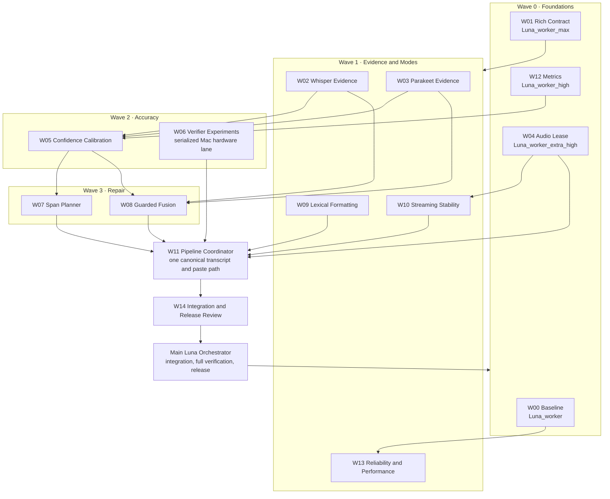

```mermaid
flowchart TD
    O[Main Luna Orchestrator<br/>integration, full verification, release]

    subgraph W0[Wave 0 · Foundations]
      W00[W00 Baseline<br/>Luna_worker]
      W01[W01 Rich Contract<br/>Luna_worker_max]
      W04[W04 Audio Lease<br/>Luna_worker_extra_high]
      W12[W12 Metrics<br/>Luna_worker_high]
    end

    subgraph W1[Wave 1 · Evidence and Modes]
      W02[W02 Whisper Evidence]
      W03[W03 Parakeet Evidence]
      W09[W09 Lexical Formatting]
      W10[W10 Streaming Stability]
      W13[W13 Reliability and Performance]
    end

    subgraph W2[Wave 2 · Accuracy]
      W05[W05 Confidence Calibration]
      W06[W06 Verifier Experiments<br/>serialized Mac hardware lane]
    end

    subgraph W3[Wave 3 · Repair]
      W07[W07 Span Planner]
      W08[W08 Guarded Fusion]
    end

    W11[W11 Pipeline Coordinator<br/>one canonical transcript and paste path]
    W14[W14 Integration and Release Review]

    O --> W0
    W01 --> W1
    W04 --> W10
    W00 --> W13
    W12 --> W05
    W02 --> W05
    W03 --> W05
    W02 --> W08
    W03 --> W08
    W05 --> W07
    W05 --> W08
    W07 --> W11
    W08 --> W11
    W09 --> W11
    W10 --> W11
    W04 --> W11
    W06 --> W11
    W11 --> W14
    W14 --> O
```
