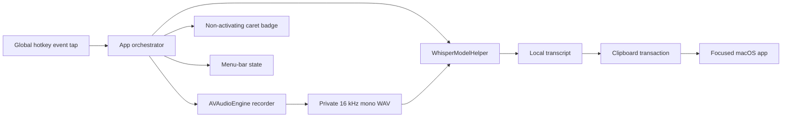

# Architecture

`whisper_hotkey` is a native Swift/AppKit macOS agent with one short-lived C++
helper. It is designed for negligible idle cost, local-only data, and explicit
ownership of every subprocess and temporary file.

## Runtime topology



At idle, only the event tap, menu item, local control socket, and app process
remain. There is no audio engine, loaded model, helper, polling worker, or
transcript history. During dictation, capture and model preload begin together.
Release, Stop, or Send finalizes the WAV, transcribes once, inserts it, tears
down the helper, and deletes the private audio directory.

## Module boundaries

| Target | Responsibility |
| --- | --- |
| `WhisperHotkeyCore` | State machine, contracts, model and limit preferences |
| `WhisperHotkeyASR` | Capture, helper lifecycle, whisper.cpp invocation, sanitization |
| `WhisperHotkeySystem` | Global input, Accessibility, pasteboard, Command-V/Return |
| `WhisperHotkeyShell` | Menu, setup, badge, login item, local control socket |
| `WhisperHotkeyApp` | Main-actor orchestration and app lifecycle |
| `whisper_hotkey` | Terminal control client |
| `WhisperModelHelper` | Per-dictation C++ bridge to whisper.cpp |
| `WhisperHotkeyLoginLauncher` | Signed one-shot login and post-exit restart launcher |

## State and delivery

```text
idle → preparing → listening → transcribing → inserting → idle
                    ↘ cancel/failure cleanup ↗
```

The input reducer distinguishes a bare modifier gesture from normal shortcuts.
Hold mode uses one cancellable 150 ms timer; toggle mode uses successive bare
presses. Effects are serialized through the main-actor state machine, and a
generation number rejects stale recognition results.

The badge prefers Accessibility caret geometry, including Chromium text
markers, and otherwise anchors to the pointer. It snapshots that geometry once
at recording start and preserves the initial panel origin across later states.
It is non-activating, so Stop and
Send do not steal destination focus. Stop and hotkey release post Command-V.
Send inserts successfully, then posts an unmodified Return. Its recording panel
joins all applications, Spaces, and full-screen sets; periodic recording updates
repair inactive-Space or unexpectedly ordered-out panel state. Those existing
20 Hz updates also drive the continuously visible elapsed/limit label and thin
duration-progress track; no additional timer or polling loop is used.

## Privacy and ownership

- Temporary audio uses a mode-0700 directory and mode-0600 WAV.
- Audio and transcripts never enter logs or network requests.
- The app has no model downloader or cloud speech client.
- `run.sh` explicitly downloads selected models and verifies pinned checksums.
- Helper process groups receive bounded TERM-to-KILL cleanup.
- Clipboard contents are restored unless another app changes them after paste.

See [MODELS.md](MODELS.md) for recognition details.
