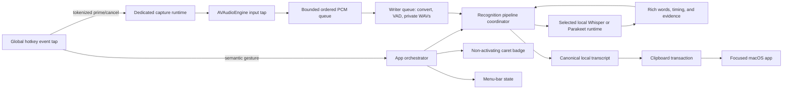

# Architecture

`whisper_hotkey` is a native Swift/AppKit macOS agent with one short-lived C++
helper. It is designed for negligible idle cost, local-only data, and explicit
ownership of every subprocess and temporary file.

## Runtime topology



At idle, the event tap, menu item, local control socket, and app process
remain active. Whether a runtime stays resident depends on processing mode:
Decode After Speaking keeps no loaded model or helper, while Model Ready and
Decode While Speaking may keep the selected recognition runtime resident (helper
for whisper.cpp, in-process runtime for Parakeet) with audio capture stopped and
no polling task added. Once a gesture is accepted, every processing mode may
prepare the selected model concurrently with ongoing capture; Decode After
Speaking still performs no decode and retains no model at idle. Release, Stop,
or Send finalizes a normal dictation, inserts it, and clears the private audio
directory; runtime teardown is skipped only when the processing mode
deliberately keeps it warm.

The physical hotkey edge only enqueues a token-scoped command. A dedicated
user-interactive serial runtime owns AVAudioEngine start, stop, tap mutation,
adoption, cancellation, and finalization. The engine starts before private
WAV/converter preparation; early native buffers are retained in a bounded FIFO.
The tap performs one bounded PCM copy and enqueue. A separate writer queue owns
conversion, speech detection, metering, canonical/segment file writes, and
ordered rotation barriers. Overflow or continuity loss invalidates capture
explicitly instead of returning a silently truncated recording.

Pause Mode retains one uninterrupted full-session WAV and writes a parallel
current inference segment from the same writer-queue samples. Its pause
threshold begins at 450 milliseconds and adapts within 300–750 milliseconds
from resumed pauses. A boundary rotates only the inference segment, serially
transcribes and pastes the phrase, and reuses the loaded helper until the active
session ends. The next decode is conditioned on at most 240 trailing characters
from the current session, sent through the helper's private JSON-line stdin
channel. Decode While Speaking reuses the same dual-file recorder without Pause
Mode's incremental paste. Its segmentation task is independent of the 20 Hz
badge presentation task and rotates speech-bearing inference segments at a
detected pause after five seconds or at an eight-second bound. Capture continues
while a strict serial recognition chain consumes only closed immutable segments
through one helper. Partial text stays in a bounded in-memory accumulator and is
inserted once after the final segment. The complete session WAV remains
available for one ordinary fallback decode if a background chunk fails.

The status menu contains only immediate actions. A lazy native Settings
window owns the key, input behavior, model, recording-limit, and Open at Login
controls; AppDelegate remains the preference source of truth. The window is
created on first use, refreshes through application/state events, and never
polls. Behavior and model choices use one-click segmented chips; longer option
sets retain native pop-up controls. Setup remains a separate
permissions-and-files repair surface.
The Settings help popover and configuration summary are created only with the
Settings window. They derive from the same in-memory state provider, perform no
I/O, and add no idle worker or timer.
HUD themes are value-type palettes selected from a persisted core preference.
Changing the dropdown updates the existing badge, Settings window, and open
opaque User Guide in place. No window, worker, timer, model, or observer is
added.

The Internal dictionary is stored as a normalized array of words or phrases in
UserDefaults. The app precomputes a capped 320-character prompt at launch and
whenever the token field changes. Normal dictation sends that prompt through
the owned helper's stdin. Pause Mode combines it with the existing bounded
session tail. No dictionary worker, file watcher, model, or timer exists at
idle, and prompt contents are never logged or exposed as process arguments.

## Module boundaries

| Target | Responsibility |
| --- | --- |
| `WhisperHotkeyCore` | State machine, contracts, model and limit preferences |
| `WhisperHotkeyASR` | Capture, exclusive engine lifecycle, whisper.cpp or Parakeet invocation, sanitization |
| `WhisperHotkeySystem` | Global input, Accessibility, pasteboard, Command-V/Return |
| `WhisperHotkeyShell` | Menu, Setup and Settings, badge, login item, local control socket |
| `WhisperHotkeyApp` | Main-actor orchestration and app lifecycle |
| `whisper_hotkey` | Terminal control client |
| `WhisperModelHelper` | Session-owned C++ bridge that can decode ordered WAV chunks with one model load |
| `WhisperHotkeyLoginLauncher` | Signed one-shot login and post-exit restart launcher |

The recognition engine preference is orthogonal to model size. Metal uses the
owned C++ helper. Parakeet is an in-process, pinned Swift package (FluidAudio)
running an NVIDIA FastConformer transducer on the Neural Engine; it can reuse a
bundled checkpoint or fetch one into the local FluidAudio cache when needed. Only
one path can be active, all consume the same private WAV contract, and no path
may silently fall back to another selected engine.

Because a transducer has no beam search and takes no prompt, the Parakeet
engine reports `usesWhisperDecoding` and `supportsPromptConditioning` as false.
Settings disables the Decoding chips from the first, and the recognizer drops
the dictionary and Pause Mode prompt from the second rather than passing text
the model cannot consume.

The C++ helper also owns both decoding profiles. Precision runs five-beam
search once. Smart Decode runs a deterministic one-candidate greedy pass,
checks token confidence and repetition in memory, and runs the same Precision
beam only when the first pass is uncertain. Confidence metadata is consumed
only for the active inference and is never logged or persisted.

## Phase 1 recognition pipeline

Both provider adapters now return the same bounded rich-result contract:
stable word identifiers, word/segment timing when the runtime supplies it,
alternatives and acoustic/decoder evidence when available, pass provenance,
and explicit missing-evidence states. No provider-facing application path
collapses recognition to a bare string before orchestration.

`RecognitionPipelineCoordinator` owns the active generation, canonical words,
original session audio, optional bounded enhancement work, and the only route
to text delivery. Decode While Speaking reconciles overlapping windows through
one bounded stable-prefix/revisable-tail accumulator. Pause Mode crosses the
delivery boundary only for accumulator-approved complete sentences; its
provisional tail stays in memory until final reconciliation. Cancellation
invalidates the generation before waiting for child work, so late results
cannot paste, and canonical audio is deleted only after every borrower unwinds.

The formatter is deterministic and lexically invariant: it may label spacing,
capitalization, punctuation, and sentence boundaries but cannot replace words.
The selective-repair components use calibrated provider evidence, bounded
original-audio spans, timestamp-aware alignment, and locked-word fusion.
Shipping configuration deliberately sets repair to `disabled`; it can become
eligible only with a matching calibration artifact and measured promotion
gates. Formatter, verifier, or deadline failures fall back to the selected
primary result. This default is also the instant primary-only rollback path.

The Phase 1 code adds no speaker identity, user acoustic profile, training,
ordinary-user corpus, transcript history, cloud request, or persistent
recognition evidence. Benchmark and verifier reports are aggregate-only and
reject content-bearing fields.

## State and delivery

```text
idle → preparing → listening → transcribing → inserting → idle
                    ↘ cancel/failure cleanup ↗
```

The input reducer distinguishes a bare modifier gesture from normal
shortcuts. Hold mode uses one cancellable 150 ms timer and rejects very short
hold releases (less than 250 ms); toggle and Pause modes use successive bare
presses. Pause boundaries come from the recorder's existing
speech-energy detector. The detector maintains a bounded exponential estimate
of the user's sub-boundary pauses; no new timer or audio analysis pass exists.
The microphone and complete recording remain uninterrupted while segment
snapshots feed recognition tasks in a strict serial chain, so phrases can never
paste out of order. Because the next task starts only after the prior result is accepted, it
can use a bounded prior-text prompt to preserve continuation punctuation and
casing. Effects are serialized through the main-actor state machine, and a
generation number rejects stale recognition results.

The badge prefers Accessibility caret geometry, including Chromium text
markers, and otherwise anchors to the pointer. The same one-time query captures
the focused element frame when available, allowing the badge to sit above the
complete field rather than obscure its text. A locality bound rejects focused
terminal surfaces whose upper edge is far from the caret; those use the exact
caret instead. Oversized field-only results fall back to the pointer. It flips
below at the top display edge. No role validation or geometry polling is added.
The badge captures geometry at recording start. During listening, an
`AXObserver` subscribes to focused-element changes on the frontmost application,
while an `NSWorkspace` activation notification moves that observer across
applications. Focus events trigger one bounded geometry refresh; there is no
placement polling or idle observer.
Automatic updates stop taking effect after the first drag and reset with the
next session.
While listening, the waveform and timer form a drag handle. Movement is clamped
to the session screen and replaces the preserved origin without changing the
Stop or Send hitboxes. The panel is non-activating, so those controls do not
steal destination focus. Stop and hotkey release post Command-V.
Send inserts successfully, then posts an unmodified Return. Its recording panel
joins all applications, Spaces, and full-screen sets; periodic recording updates
repair inactive-Space or unexpectedly ordered-out panel state. Those existing
updates reuse one registered panel for the process lifetime, so repeated
dictations cannot accumulate hidden WindowServer windows. The same 20 Hz
updates also drive the continuously visible elapsed/limit label and thin
duration-progress track; no additional timer or polling loop is used.

## Privacy and ownership

- Temporary audio uses a mode-0700 directory and mode-0600 WAV.
- Pause Mode and Decode While Speaking retain complete session audio only until
  that active session ends; the full WAV and every inference segment share the
  same cleanup guarantees.
- Audio and transcripts never enter logs or network requests.
- The app has no model downloader or cloud speech client.
- `run.sh` explicitly downloads selected models and verifies pinned checksums.
- Helper process groups receive bounded TERM-to-KILL cleanup.
- Clipboard contents are restored unless another app changes them after paste.

See [MODELS.md](MODELS.md) for recognition details.
