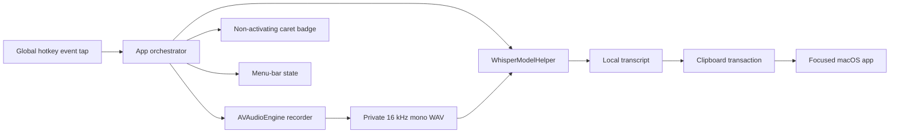

# Architecture

`whisper_hotkey` is a native Swift/AppKit macOS agent with one short-lived C++
helper. It is designed for negligible idle cost, local-only data, and explicit
ownership of every subprocess and temporary file.

## Runtime topology



At idle, only the event tap, menu item, local control socket, and app process
remain. There is no audio engine, loaded model, helper, polling worker, or
transcript history. During dictation, capture and model preload begin together.
Release, Stop, or Send finalizes a normal dictation, inserts it, tears down the
helper, and deletes the private audio directory. Pause Mode retains one
uninterrupted full-session WAV and writes a parallel current inference segment
from the already-converted callback buffer. Its pause threshold begins at
450 milliseconds and adapts within 300–750 milliseconds from resumed pauses.
A boundary rotates only the inference segment, serially transcribes and pastes
the phrase, and reuses the loaded helper until the active session ends.
The next decode is conditioned on at most 240 trailing characters from the
current session, sent through the helper's private JSON-line stdin channel.

The status menu contains only immediate actions. A lazy native Advanced Settings
window owns the key, input behavior, model, recording-limit, and Open at Login
controls; AppDelegate remains the preference source of truth. The window is
created on first use, refreshes through application/state events, and never
polls. Setup remains a separate permissions-and-files repair surface.

## Module boundaries

| Target | Responsibility |
| --- | --- |
| `WhisperHotkeyCore` | State machine, contracts, model and limit preferences |
| `WhisperHotkeyASR` | Capture, helper lifecycle, whisper.cpp invocation, sanitization |
| `WhisperHotkeySystem` | Global input, Accessibility, pasteboard, Command-V/Return |
| `WhisperHotkeyShell` | Menu, Setup and Advanced Settings, badge, login item, local control socket |
| `WhisperHotkeyApp` | Main-actor orchestration and app lifecycle |
| `whisper_hotkey` | Terminal control client |
| `WhisperModelHelper` | Session-owned C++ bridge that can decode ordered WAV chunks with one model load |
| `WhisperHotkeyLoginLauncher` | Signed one-shot login and post-exit restart launcher |

## State and delivery

```text
idle → preparing → listening → transcribing → inserting → idle
                    ↘ cancel/failure cleanup ↗
```

The input reducer distinguishes a bare modifier gesture from normal shortcuts.
Hold mode uses one cancellable 150 ms timer; toggle and Pause modes use
successive bare presses. Pause boundaries come from the recorder's existing
speech-energy detector. The detector maintains a bounded exponential estimate
of the user's sub-boundary pauses; no new timer or audio analysis pass exists.
The microphone and complete recording remain uninterrupted while segment
snapshots feed recognition tasks in a strict serial chain, so phrases can never
paste out of order. Because the next task starts only after the prior result is accepted, it
can use a bounded prior-text prompt to preserve continuation punctuation and
casing. Effects are serialized through the main-actor state machine, and a
generation number rejects stale recognition results.

The badge prefers Accessibility caret geometry, including Chromium text
markers, and otherwise anchors to the pointer. It snapshots that geometry once
at recording start and preserves the initial panel origin across later states.
It is non-activating, so Stop and
Send do not steal destination focus. Stop and hotkey release post Command-V.
Send inserts successfully, then posts an unmodified Return. Its recording panel
joins all applications, Spaces, and full-screen sets; periodic recording updates
repair inactive-Space or unexpectedly ordered-out panel state. Those existing
updates reuse one registered panel for the process lifetime, so repeated
dictations cannot accumulate hidden WindowServer windows. The same 20 Hz
updates also drive the continuously visible elapsed/limit label and thin
duration-progress track; no additional timer or polling loop is used.

## Privacy and ownership

- Temporary audio uses a mode-0700 directory and mode-0600 WAV.
- Pause Mode retains complete session audio only until that active session ends;
  the full WAV and every inference segment share the same cleanup guarantees.
- Audio and transcripts never enter logs or network requests.
- The app has no model downloader or cloud speech client.
- `run.sh` explicitly downloads selected models and verifies pinned checksums.
- Helper process groups receive bounded TERM-to-KILL cleanup.
- Clipboard contents are restored unless another app changes them after paste.

See [MODELS.md](MODELS.md) for recognition details.
