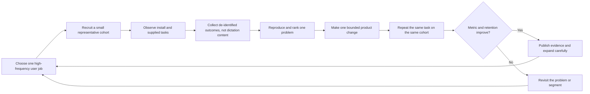
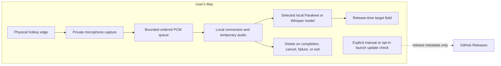
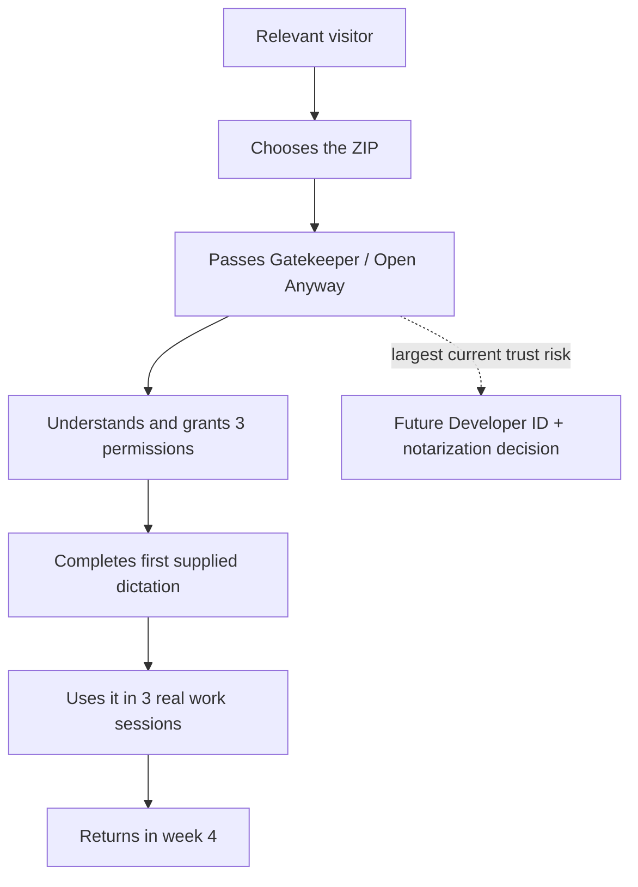
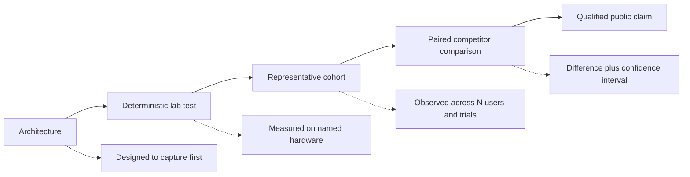

# Reusable diagrams

## User-to-product learning loop

## Privacy boundary

The dotted update path is separate from dictation. Verify exact behavior for
the release before publishing this diagram.

## Activation funnel

## Evidence before claims

## Positioning map

| | Focused dictation | Broad workspace/agent suite |
| --- | --- | --- |
| **Local and verifiable by default** | Target: `whisper_hotkey`; literal, ephemeral, measured | Pindrop, MacParakeet, OpenWhispr local modes |
| **Cloud or hybrid** | Aqua, Wispr Flow, parts of Superwhisper/Spokenly | Meeting, note, and agent platforms |

The map is a strategic simplification, not a claim that competitors fit only
one cell.
